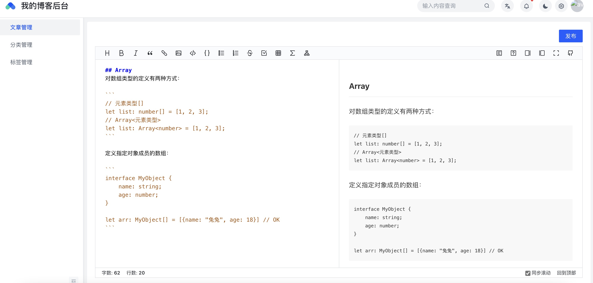
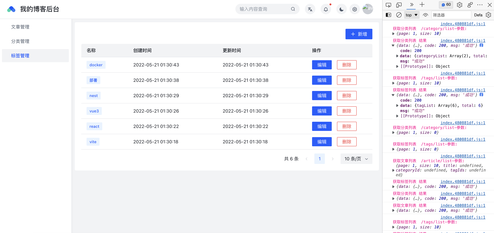
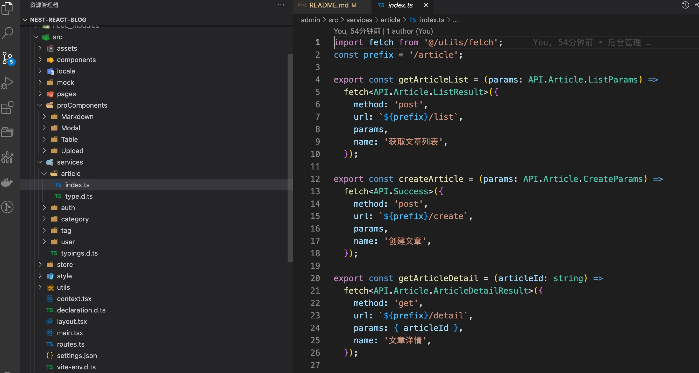

<!-- 简体中文 | [English](./README.en-US.md) -->
<h1 align="center">自己的博客</h1>

<div align="center">
适合想学习 nest,react,vue3,docker 做一套属于自己的博客的同学
</div>

- 在线演示 - [后台管理](http://101.42.99.84/blog-back/login)
- 在线演示 - [客户端](http://101.42.99.84/blog-client/home)
- 接口文档演示 - [接口文档](http://101.42.99.84:9090/docs/)

## 技术栈

- 后台管理 - react + vite + ts + hooks + windicss （基于 Acro Design Pro 搭建）
- 客户端 - vue3 + vite + ts + windicss
- 服务端 - nest + typeorm + mysql + ts + docker

## 学习地址

- 新的开源计划 - [可视化dataV](http://101.42.99.84/newDataV/index.html)

## 感谢
如果觉得你对你有帮助，给个star吧~ 谢谢

## react 后台管理

- 后台 react 项目中基于 table modal upload markdown 编辑器 做了简单的二次封装.
- 基于 axios+ts 对接口进行了二次封装 统一定义 interface
- 基于 axios 打印了响应结果 请求参数 以及 功能名称 方便小伙伴公司开发环境调试对接

<div align="center">
 
  
</div>

<br/>



## nest 服务端

- swagger 接口文档
- 接口错误异常统一处理返回 code msg 前端统一弹出 msg 提示
- CURD 接口实现
- 根据角色配置权限 jwt 生成 token
- 登录注册 加密 等等……

> 本人服务端nest学习参考的 [Nest.js 实战系列](https://juejin.cn/post/7032079740982788132)

<!-- https://juejin.cn/post/7032079740982788132 -->

## 目录结构

- admin 后台管理
- client 客户端
- service 服务端

## 使用

1. 下载项目代码。

```bash
git clone https://github.com/wmy94827/nest-react-blog.git my-blog
cd my-blog
```

2. 服务端项目启动

service项目中 .env.example修改成.env 并修改 账号密码等配置信息 默认开启自动实体

本地创建对应的数据库 然后启动


```bash
cd service
yarn install
yarn start:dev
```

3. 后台项目启动

```bash
cd admin
yarn install
yarn dev
```

4. 客户端项目启动

```bash
cd client
yarn install
yarn dev
```

## 注意事项

1.需要先启动service项目为后台和客户端项目提供服务


